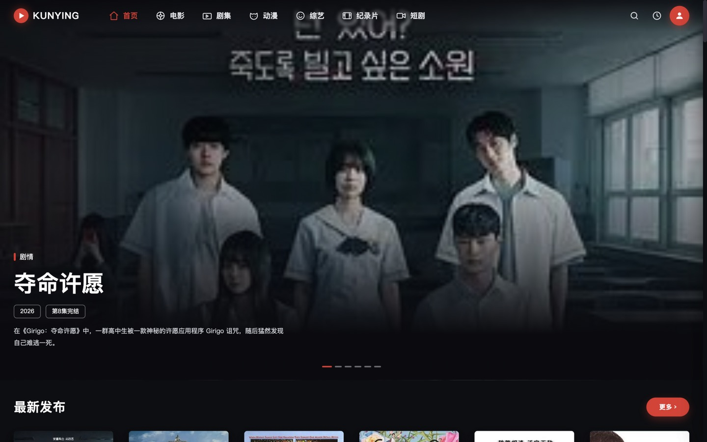
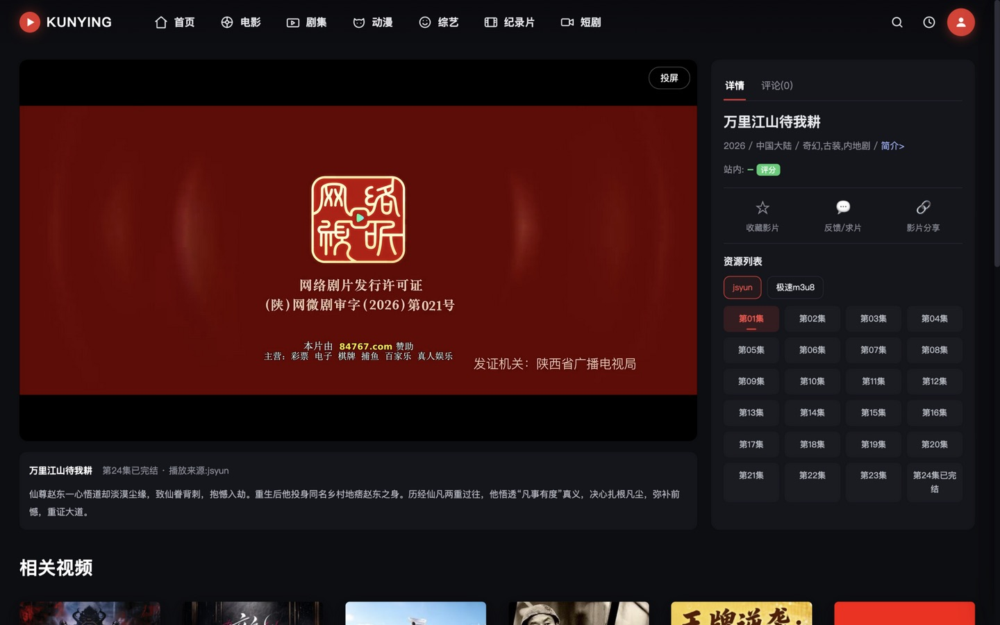
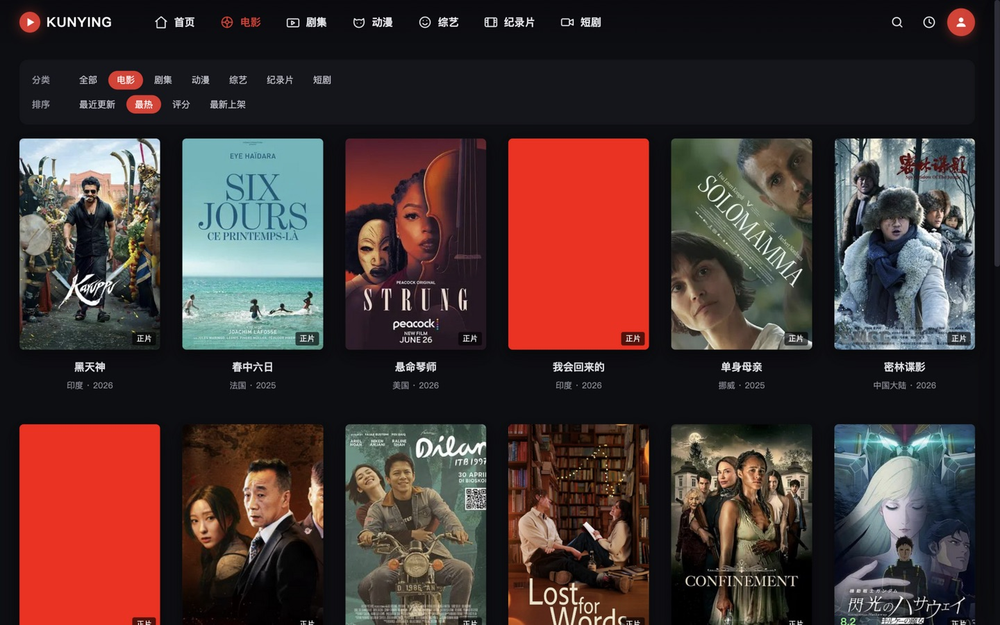
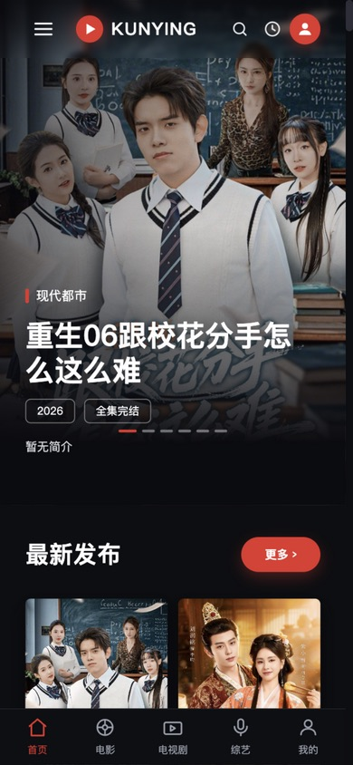
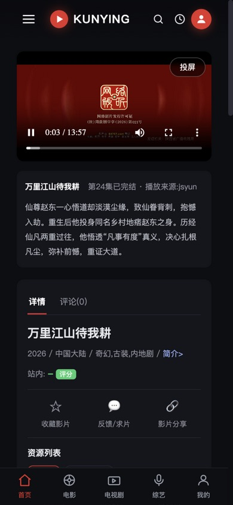

# 坤影CMS (KunYing CMS)

   

<p align="center">
  <b>全新一代影视内容管理系统</b><br>
  傻瓜式一键安装 · 内置采集 · 电影海报墙 · 多主题切换 · 手机自适应
</p>

---

## ✨ 简介

坤影CMS 是一套精心打磨的影视内容管理系统，兼容苹果CMS v10 标准资源接口。
内置采集中心、多主题模板体系、播放器投屏/选集/线路切换、会员/VIP/积分支付体系、
搜索联想、评论审核、页面缓存加速等完整功能，开箱即用。

## 🚀 核心特性

- **傻瓜式一键安装**：上传 → 访问域名 → 全程自动建库建表、自动配置目录权限
- **内置采集中心**：兼容苹果CMS v10 JSON接口，支持定时采集、按资源分类采集、
  采集速度档位（温和/慢速/标准/极速）、同名影片自动合并、封面图片本地化
- **电影海报墙**：全站视频统一电影海报模式展示（竖版2:3封面+评分+居中片名）
- **全屏大图幻灯**：后台幻灯管理可自定义大图轮播，支持指定数据源与数量
- **多播放线路**：影片多来源播放地址自动合并，线路/剧集即时切换
- **投屏**：移动端自动搜索同一WiFi下的电视设备（Remote Playback / AirPlay）
- **搜索联想**：输入即搜，同类型影片海报卡片下拉实时推荐
- **观看历史**：本地记录 + 云端同步双记录
- **会员/积分/VIP**：充值套餐、积分签到、VIP专享影片、单片积分解锁
- **支付**：码支付 / 易支付 / USDT-TRC20免挂 / 微信官方 / 支付宝官方 / 支付宝当面付
- **页面缓存**：游客页面缓存+后台操作自动失效，详情页毫秒级打开
- **安全**：全参数PDO预处理、CSRF Token、XSS过滤、SSRF防护、评论审核、搜索限频、后台登录锁定

## 📸 界面预览

**桌面端首页(全屏幻灯+电影海报墙)**


**播放页(多线路/选集/自动换线)**


**分类筛选页**


**移动端(底部Tab栏/自适应)**
 

## 📦 环境要求

| 项目 | 要求 |
|---|---|
| PHP | 7.4+（推荐 8.0-8.2，启用 OPcache 更佳） |
| 数据库 | MySQL 5.7+ / 8.0 |
| PHP扩展 | pdo_mysql、curl、gd、mbstring、zip、fileinfo、openssl |
| Web服务 | Nginx / Apache（伪静态可选） |

## 🛠 一键安装教程

### 1. 上传程序
将程序文件上传至网站根目录（如 `/www/wwwroot/你的域名/`）。

### 2. 访问域名
浏览器打开 `https://你的域名/`，自动进入安装向导：

- **第1步 环境检测**：程序自动检查 PHP 版本、扩展与目录权限
  （所有工作目录自动创建并索要 755 权限，一般无需手工操作）
- **第2步 配置数据库**：填写数据库地址/账号/密码与管理员账号密码
  （数据库不存在会自动创建）
- **第3步 安装完成**：自动建库建表+写入默认数据（分类/幻灯/采集源/播放器）

> 安装完成后程序会**自动删除 `install` 目录**(若个别环境权限不足删除失败,完成页会提示手动删除)。

### 3. 伪静态（可选但推荐）
Nginx 参考（宝塔用户在网站设置-伪静态中添加）：
```nginx
# ---- 安全防护(必须放在最前面) ----
location ~* ^/(ky|data)/ { deny all; }
location ~* ^/(theme|addon)/.*\.php$ { deny all; }
location ~* ^/upload/.*\.(php|phtml|phar)$ { deny all; }
# ---- 伪静态 ----
location / { try_files $uri $uri/ /index.php?s=$uri&$query_string; }
rewrite ^/detail-(\d+)\.html$ /index.php?s=/vod/detail&id=$1 last;
rewrite ^/type-(\d+)\.html$ /index.php?s=/vod/type&id=$1 last;
```
开启方法：后台 → 系统设置 → 伪静态URL → 开启。

### 4. Docker 部署
```bash
docker-compose up -d
```

## 🎨 主题体系

| 主题 | 说明 | 费用 |
|---|---|---|
| **kylite**（默认） | 浅色简洁风格，白卡片海报墙，手机自适应 | 免费 |
| **KUNPRO** | 星辰影院风格：展开式导航+全屏大图幻灯+电影海报墙 | 专业版 |
| **爱奇艺风格** | 大图幻灯+横竖混排信息流，海报大卡沉浸浏览 | 专业版 |

后台 → 系统设置 → 默认模板 中一键切换。

## 💎 专业版（99元 永久）

开通专业版会员，**全部付费主题与付费插件免费使用**。

**开通方式**：前往授权站购买专业版 → 获取激活码 → 后台 拓展→市场→激活码激活

**域名绑定规则**：
- 使用主域名（`xxx.com` 或 `www.xxx.com`）：激活后 **www 与裸域名均可使用**
- 使用子域名（如 `ys.xxx.com`）：仅该子域名可用

## 📡 采集教程

1. 后台 → 采集中心 → 采集管理（已内置多个可用资源接口，也可自行添加）
2. 点击接口地址**进入接口详情页**：自动拉取资源站全部分类
3. 点击分类查看该分类资源列表 → 选择采集范围（全量/近24小时等）→ 开始采集
4. 采集速度可在 温和/慢速/标准/极速 间切换（防封IP请用温和模式）
5. 定时采集：开启后按设定间隔自动采集近12小时更新

**去重说明**：同名影片自动合并播放地址；封面已存在的影片不再重复下载；
播放地址按集数URL增量去重，已有地址绝不重复写入。

## 📂 目录结构

```
├── index.php              # 入口文件
├── admin.php              # 后台入口
├── install/               # 一键安装向导(装完可删)
├── ky/
│   ├── Controller/        # 控制器(前台/后台)
│   ├── Lib/               # 类库(Db/Http/License/Collector…)
│   ├── View/              # 后台视图
│   ├── cron/              # 定时任务脚本
│   ├── Func.php           # 全局函数(缓存/主题运行时/工具)
│   └── Core.php           # 路由与内核
├── theme/
│   ├── kylite/            # 默认主题(开源) 浅色海报墙
│   ├── kunpro/            # 付费主题(加密) 星辰影院风格
│   └── iqiyi/             # 付费主题(加密) 爱奇艺风格
├── static/                # 全局静态资源
├── upload/vod/            # 采集图片本地化目录
├── data/                  # 缓存/配置(自动生成)
├── docker-compose.yml     # Docker编排
└── Dockerfile
```

## ⏰ 定时采集(Cron)

开启后台"定时采集"后,添加系统Cron(宝塔:计划任务-Shell脚本,选N分钟):
```bash
# 推荐每30分钟执行一次(与后台设置保持一致)
/php/82/bin/php /www/wwwroot/你的域名/ky/cron/collect.php > /dev/null 2>&1
```
后台可设采集间隔与更新范围(近12小时),配合速度档位避免触发资源站限制。

## ❓ 常见问题

**Q: 在线安装主题提示创建目录失败？**
安装程序已自动配置目录权限。如仍失败，请 SSH 执行：
`chown -R www:www 网站根目录 && chmod -R 755 网站根目录`

**Q: 某个片源播放不了？**
播放器会自动按资源站规律修复播放页地址；同一影片一般有多个线路，
请在播放页右侧“资源列表”切换其他线路。

**Q: 缓存如何清理？**
后台右上角“🧹 清理缓存”一键清理；修改任何内容后缓存自动失效。

## 🙏 特别鸣谢

**本项目的赞助商：**

### [跨境VPS · www.kjvps.com](https://www.kjvps.com/)

感谢「跨境VPS」对本项目开发的大力支持！

## 📋 更新日志

**v1.0.29 (2026-09-23) 当前版本**
- ✨ 新增**百度链接自动推送**:新影片采集上线后自动实时推送至百度收录接口
- 后台系统设置新增"百度推送站点/token"配置(ziyuan.baidu.com获取)

**v1.0.28 (2026-09-23)**
- 🔍 播放页新增**JSON-LD视频结构化数据**:搜索引擎富摘要、缩略图绝对地址,双主题同步

- 🔍 播放页新增**JSON-LD视频结构化数据**:搜索引擎富摘要、缩略图绝对地址,双主题同步

**v1.0.27 (2026-09-23)**
- 🐛 **PHP 7.4完整兼容修复**:6处PHP 8专属函数(str_contains/str_starts_with)散布在
  采集/代理/重定向/插件安装/更新校验核心路径,PHP 7.4下会导致采集崩溃、代理播放失效、
  插件安装失败——已全部替换为7.4兼容写法
- 🏗 CI新增PHP7.4兼容性函数扫描守卫,此类问题今后无法再进入代码库

**v1.0.26 (2026-09-23)**
- 🐛 **重要修复**:定时采集逻辑恢复 + 磁盘看门狗

**v1.0.25 (2026-09-22)**
- 🐛 修复全新安装失败(CI-E2E发现)

**v1.0.24 (2026-09-22)**
- 🧪 CI新增全新安装E2E验证

**v1.0.23 (2026-09-22)**
- 🏗 GitHub Actions CI + 数据运维自动化 + README截图


- 🐛 **重要修复**:v1.0.14引入的缺陷导致定时采集只执行维护、从不采集,现已完整恢复采集逻辑
- 🛡 新增磁盘看门狗:剩余<3GB自动暂停采集,防止写满磁盘

**v1.0.25 (2026-09-22)**
- 🐛 修复默认采集源参数缺失导致的全新安装失败(CI-E2E发现)

**v1.0.24 (2026-09-22)**
- 🧪 CI新增全新安装E2E验证

**v1.0.23 (2026-09-22)**
- 🏗 新增GitHub Actions CI
- 📊 数据运维自动化 + README截图


**v1.0.22 (2026-09-22)**
- 🐛 修复图片自动清理从未实际执行的问题,接入每日定时任务

**v1.0.21 (2026-09-22)**
- 🔧 仓库结构清理,版本号规范同步

**v1.0.20 (2026-09-22)**
- ✨ 用户中心新增**账号设置**:自助修改昵称(2-20字符)与修改密码(验旧密码),双主题同步

**v1.0.19 (2026-09-22)**
- ✨ 新增**忘记密码/自助找回**:登录页入口 → 注册邮箱收重置码 → 设置新密码
- 双主题(默认+付费)同步支持;防刷齐备:同邮箱1分钟1条/10分钟3条、重置尝试10次/10分钟、重置码一次性消费

**v1.0.18 (2026-09-22)**
- 🔍 **SEO全家桶**:内置sitemap站点地图(5000条最新影片+全部分类,自动感知伪静态,1小时缓存)、robots.txt
- 📱 **OG分享卡片**:影片详情页分享到微信/QQ/Telegram时显示片名+简介+封面大图,并输出canonical规范链接
- 详情页伪静态与动态地址自动适配

**v1.0.16 (2026-09-22)**
- ✨ 默认主题kylite新增**手机底部Tab栏**(首页/分类/搜索/会员/我的,当前页高亮),与付费主题功能对齐
- 🐛 修复模板作用域缺少当前控制器/动作变量的高亮失效问题

**v1.0.15 (2026-09-22)**
- 🔒 后台所有POST操作统一增加CSRF Token服务端校验(此前仅依赖SameSite Cookie防护)
- 管理端前端本就随请求携带令牌,此变更对正常使用零影响

**v1.0.14 (2026-09-22)**
- 🐛 修复图片自动清理功能从未实际执行的缺陷:已接入每日定时任务(开启开关后0-5点窗口执行,每天一次)
- 🔒 清理函数移除5000张扫描上限,改为分批全量扫描引用——避免大体量站点误删在用封面
- 清理引用源含影片封面与幻灯图片

**v1.0.13 (2026-09-22)**
- 🐛 完善线路自动切换:换线时**保持当前集数**(此前会跳回第1集);
  起播失败(未超过5秒)自动换线,观看中途断流则仅提示、不强行跳转
- 🐛 换线到集数较少的线路时自动钳制到末集,不再出现空白播放器

**v1.0.12 (2026-09-22)**
- ✨ 播放器新增**线路故障自动切换**:当前线路流错误(致命HLS错误/视频加载失败)时自动换到下一线路并提示,全部线路轮尽才提示失败;起播成功自动重置计数
- 🐛 修复播放器资源版本号引用错误(指向已废弃主题路径,导致播放器库更新后浏览器缓存不刷新)

**v1.0.11 (2026-09-22)**
- ⚡ 播放页加载性能优化:hls.js(415KB)与播放器JS由阻塞式加载改为defer异步加载,
  页面文字/封面/选集列表即到即显,播放器在脚本就绪后自动初始化
- 此前播放页HTML解析会停下来等待415KB的播放器库下载完,慢线路上表现为长时间白屏

**v1.0.10 (2026-09-22)**
- ⚡ 修复观看视频后返回首页卡顿的问题:播放页后台探测播放源前未释放会话锁,
  同一用户的下一个请求会阻塞在会话加锁上(登录用户尤其明显),现已先释放再探测

**v1.0.9 (2026-09-22)**
- 🔐 付费主题保护机制升级:主题解密密钥不再随程序分发,改为**授权验证通过后由控制端下发**(本地缓存30天自动续期,离线宽限期内可持续使用)
- 未通过授权验证的站点无法解密付费主题文件;已授权站点体验完全不变

**v1.0.8 (2026-09-22)**
- ✨ KUNPRO首页幻灯新增**点击进入影片**:点击幻灯任意位置跳转当前影片详情页(后台幻灯用配置链接,自动幻灯按影片ID跳转)
- 🐛 修复拖拽手势对点击的影响:指针捕获改为确认拖拽意图后才启用,普通点击不再被劫持;圆点切换与点击跳转互不干扰

**v1.0.7 (2026-09-22)**
- 🐛 修复采集起始页大于当前筛选范围总页数时的显示错乱(如"56/8页100%"):现在会明确提示并将起始页重置
- ✨ 切换到按时间筛选(24/12/6小时)时自动把起始页重置为1,避免残留大页码

**v1.0.6 (2026-09-22)**
- 🐛 修复快速采集/分类采集在连续采集35~40页后停止的问题:资源站限流返回错误时,原逻辑直接终止循环
- 🛡 采集循环现具备自愈能力:单页失败自动重试3次(3/6/9秒退避),仍失败跳过该页15秒后继续,连续10页失败才停止
- ⏱ 单页采集服务端时限120秒→600秒,封面本地化慢速页不再被截断

**v1.0.5 (2026-09-22)**
- 📱 KUNPRO主题首页幻灯新增**手动滑动**:手机端直接左右滑动切换,电脑端按住图片拖拽切换(Pointer Events统一实现)
- 拖拽跟手反馈(背景位移+淡出),小幅拖动不误触,拖后自动拦截误点链接,纵向滚动不受影响

**v1.0.4 (2026-09-22)**
- 🛡 安装完成后**自动删除 install 目录**,无需手动操作(删除失败时完成页明确提示)
- 更彻底地消除安装器残留风险

**v1.0.3 (2026-09-22)**
- 🐛 签到接口并发竞态修复:原子化sign_day守卫防重复加积分,积分改SQL自增避免旧值覆盖并发到账
- 🔒 签到接口补充CSRF校验

**v1.0.2 (2026-09-22)**
- 🔒 支付回调新增订单金额比对(±0.01),杜绝可改金额渠道的绕过
- 🔒 定时采集脚本仅允许CLI执行,Web访问返回403
- 🔒 新增 data/.htaccess(禁Web访问)与 upload/.htaccess(禁脚本执行)双重防护
- 📖 README补充Nginx安全防护规则(保护ky/data/theme/upload目录)
- 🎨 KUNPRO主题导航栏图标与文字垂直居中修复

**v1.0.0 (2026-09)**
- 首个开源版本发布
- 3套主题(1开源+2付费加密)、采集中心、会员支付体系、页面缓存、OPcache深度优化
- 全面安全加固:PDO预处理/CSRF/XSS/SSRF防护/评论审核/后台锁定

## 📄 授权说明

本项目程序主体供学习交流使用。请勿用于任何违法违规用途，
影视内容均来自互联网收集，版权归原作者所有，如有侵权请联系删除。
